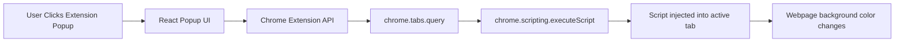

# Vite Chrome Extension


A modern **Chrome Extension built with Vite, React, and TypeScript**.

This project demonstrates how to build a Chrome extension using a modern
frontend stack and inject scripts into the active browser tab using the
**Chrome Extensions API**.

The extension allows the user to select a color and apply it as the
background color of the current webpage.


------------------------------------------------------------------------

# Architecture



------------------------------------------------------------------------

# Features

-   Built with **Vite**
-   **React + TypeScript**
-   Chrome Extension **Manifest V3**
-   Script injection using **chrome.scripting API**
-   Color picker to dynamically change page background
-   Fast development with **Vite build system**

------------------------------------------------------------------------

# Project Structure

    vite-chrome-extension
    │
    ├── dist/                # Production build loaded into Chrome
    │   ├── assets/
    │   ├── index.html
    │   ├── icon32.png
    │   └── manifest.json
    │
    ├── public/
    │   ├── icon32.png
    │   └── manifest.json
    │
    ├── src/
    │   ├── assets/
    │   ├── App.tsx
    │   ├── App.css
    │   ├── main.tsx
    │   └── index.css
    │
    ├── index.html
    ├── package.json
    ├── tsconfig.json
    └── vite.config.ts

------------------------------------------------------------------------

# Installation

Clone the repository

    git clone https://github.com/yanamak89/vite-chrome-extension.git

Navigate into the project

    cd vite-chrome-extension

Install dependencies

    npm install

------------------------------------------------------------------------

# Build the Extension

    npm run build

The production files will be generated inside:

    dist/

------------------------------------------------------------------------

# Load Extension in Chrome

1.  Open Chrome
2.  Navigate to:

```{=html}
<!-- -->
```
    chrome://extensions

3.  Enable **Developer Mode**
4.  Click **Load unpacked**
5.  Select the **dist/** folder

Your extension will now appear in the Chrome toolbar.

------------------------------------------------------------------------

# How It Works

When the user clicks the button in the popup:

1.  The extension gets the **active tab**
2.  Uses **chrome.tabs.query**
3.  Injects a script into the page using
    **chrome.scripting.executeScript**
4.  The script updates the page background color

Example:

``` ts
await chrome.scripting.executeScript({
  target: { tabId: tab.id },
  args: [color],
  func: (selectedColor) => {
    document.body.style.backgroundColor = selectedColor
  }
})
```

------------------------------------------------------------------------

# Development

Run development server

    npm run dev

Note: Chrome extensions must be **built before loading into Chrome**, so
remember to run:

    npm run build

before testing the extension.

------------------------------------------------------------------------

# Permissions

The extension uses the following permissions:

    "scripting"
    "tabs"

These allow the extension to execute scripts inside the active tab.

------------------------------------------------------------------------

# Tech Stack

-   Vite
-   React
-   TypeScript
-   Chrome Extensions API
-   Manifest V3

------------------------------------------------------------------------

# Author

**Yana Makogon**

GitHub: https://github.com/yanamak89

------------------------------------------------------------------------

# License

MIT License
